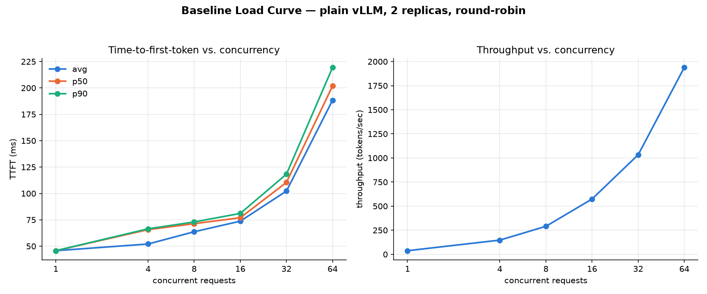

# KV-Cache-Aware Routing with llm-d

A hands-on benchmark project comparing [llm-d](https://llm-d.ai) (a Kubernetes-native distributed inference stack built on vLLM) against a plain vLLM deployment, to quantify what KV-cache-aware routing and disaggregated prefill/decode actually buy you in throughput and latency.

## Why this project

Serving LLMs behind a naive load balancer has two blind spots:
- **Prefill and decode compete for the same GPU.** Prefill (processing the prompt) is compute-bound; decode (generating tokens) is memory-bandwidth-bound. A long incoming prompt can stall token generation for requests already in flight.
- **Generic load balancers are blind to KV cache.** A follow-up request in the same conversation might get routed to a cold replica instead of the one that already has that conversation's KV cache resident in GPU memory.

llm-d addresses both with a smart Inference Gateway (EndpointPicker) and disaggregated prefill/decode worker pools. This project deploys both a baseline (plain vLLM, round-robin) and an llm-d setup on identical hardware, and benchmarks them under the same workload to get real numbers instead of taking the benefit on faith.

## Architecture

**Baseline:** 2 identical vLLM replicas behind a standard Kubernetes Service (round-robin load balancing), serving `meta-llama/Llama-3.2-3B-Instruct`.

**llm-d:** Same 2 GPUs, reconfigured as 1 dedicated prefill worker + 1 dedicated decode worker, registered in a single `InferencePool` behind llm-d's Inference Gateway. The EndpointPicker (EPP) routes each request based on real-time KV-cache/GPU utilization signals rather than round-robin, and orchestrates the prefill → KV-cache-transfer → decode handoff via NIXL.

> **Note on networking:** `g6.xlarge` nodes don't support RDMA-capable networking (e.g. AWS EFA), so NIXL falls back to its TCP transport for cross-node KV cache transfer instead of RDMA/InfiniBand. This means the absolute numbers here understate llm-d's best-case performance on production RDMA hardware — but the head-to-head comparison against the baseline is still valid, since it isolates the same variable (smart routing + disaggregation vs. none) under an equivalent network ceiling.

## Infrastructure

- **Cluster:** AWS EKS with a managed GPU node group — 2x `g6.xlarge` (1x NVIDIA L4, 24GB VRAM each), one node per role (prefill / decode).
- **Model:** `meta-llama/Llama-3.2-3B-Instruct`
- **Serving engine:** vLLM
- **Orchestration:** Kubernetes (EKS) + llm-d Helm charts (`llm-d-deployer`) + Gateway API Inference Extension

### Estimated cost

| Item | Rate |
|---|---|
| EKS control plane | $0.10/hr |
| 2x `g6.xlarge` (1x NVIDIA L4 each) | $0.8048/hr each (~$1.61/hr combined) |
| **Total while cluster is running** | **≈ $1.72/hr** |

Cluster is torn down (`eksctl delete cluster`) as soon as both benchmark runs are complete — billing runs whether or not anything is deployed on the nodes.

## Benchmark methodology

Both deployments are load-tested with identical traffic (`vllm`'s `benchmark_serving.py` against a ShareGPT-style mixed workload of short and long prompts, including simulated multi-turn conversations), swept across multiple concurrency levels (1, 4, 8, 16, 32, 64 concurrent requests) rather than a single load point — the goal is to see *where* and *how much* the two deployments diverge as contention increases, not just how each performs at one arbitrary load level. Compared on:
- Time-to-first-token (TTFT), P50/P90, plotted against concurrency
- Inter-token latency (ITL)
- Overall throughput (tokens/sec)

## Status

- [x] Architecture research and benchmark design
- [x] Provisioned GPU compute, hit and resolved infra blockers (see [`ISSUES_LOG.md`](./ISSUES_LOG.md))
- [x] AWS GPU quota approved, EKS cluster config (`eks-cluster.yaml`) ready to launch
- [ ] EKS cluster with GPU node group live
- [x] Baseline vLLM deployment live and validated (2 replicas, 1 GPU each, confirmed serving real completions)
- [x] Benchmark #1 complete: baseline multi-turn cache-routing test (`benchmark/baseline_multiturn.json`) and load-curve test across concurrency 1-64 (`benchmark/baseline_load_curve.json`), both using real ShareGPT conversations/prompts
- [ ] Deploy llm-d, re-run both benchmarks for comparison
- [ ] llm-d deployment + benchmark run
- [ ] Results writeup and comparison

See [`ISSUES_LOG.md`](./ISSUES_LOG.md) for a real-time log of problems hit along the way (e.g. RunPod's nested-container GPU pods not being privileged enough to run k3s) and how they were resolved — infra debugging is half the point of this project.

## Results

**Baseline concurrency/latency curve** (plain vLLM, 2 replicas, round-robin — no cache-aware routing, no disaggregation):

TTFT holds under 75ms through concurrency 16, then climbs sharply — P90 reaches 219ms at concurrency 64, a ~4.8x increase over the single-request baseline — while throughput keeps scaling close to linearly. That gap between "throughput is fine" and "latency is degrading" is exactly the contention llm-d's disaggregated prefill/decode is meant to relieve; the llm-d curve will be overlaid here once that deployment and its matching benchmark run are complete.

_Multi-turn cache-routing comparison (baseline vs. llm-d): pending llm-d deployment._

## Acknowledgments

Built on [llm-d](https://llm-d.ai) and [vLLM](https://github.com/vllm-project/vllm).
