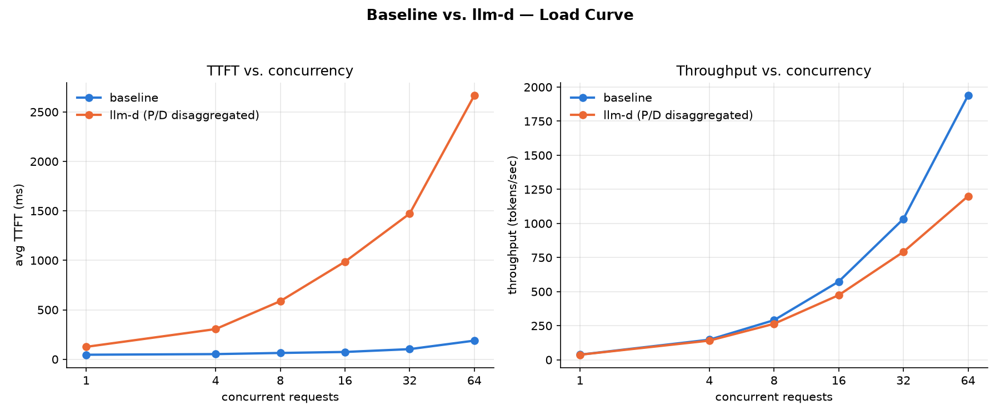
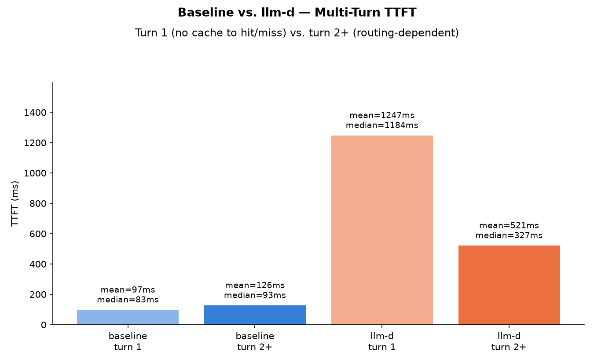

# KV-Cache-Aware Routing with llm-d

Does [llm-d](https://llm-d.ai) — a Kubernetes-native distributed inference stack built on vLLM — actually make LLM serving faster? I deployed both llm-d and a plain vLLM baseline on identical AWS GPU infrastructure and benchmarked them head-to-head to find out, instead of taking the benefit on faith.

## TL;DR

- **Built:** two Kubernetes deployments on the same 2-GPU AWS EKS cluster — a plain vLLM baseline (round-robin) and llm-d (disaggregated prefill/decode + smart routing) — and benchmarked both with real workloads.
- **Found:** in this setup, llm-d was *slower* than the plain baseline, not faster. That's a real, honestly-measured result, not a bug — and it's explained in detail below, including why it actually matches llm-d's own documented guidance.
- **Along the way:** hit and diagnosed 10+ real infrastructure bugs, including discovering that llm-d's official "quickstart" installer has been abandoned upstream for over a year. Full log in [`ISSUES_LOG.md`](./ISSUES_LOG.md).

## The problem this project measures

Serving an LLM behind a plain load balancer has two blind spots:
- **Prefill and decode compete for the same GPU.** Prefill (processing the incoming prompt) is compute-bound; decode (generating tokens one at a time) is memory-bandwidth-bound. A long prompt can stall token generation for requests already in flight on the same GPU.
- **A generic load balancer is blind to KV cache.** A follow-up message in the same conversation might get routed to a "cold" replica instead of the one that already has that conversation's context cached in GPU memory, forcing an avoidable recomputation.

llm-d addresses both with a smart routing layer (the EndpointPicker, or "EPP") and dedicated prefill/decode worker pools connected via NIXL for cache transfer. The question this project asks: **does that actually pay off, and under what conditions?**

## What I built

**Baseline** — 2 identical vLLM replicas behind a standard Kubernetes Service (round-robin), serving `meta-llama/Llama-3.2-3B-Instruct`.

**llm-d** — the same 2 GPUs, reconfigured as 1 dedicated prefill worker + 1 dedicated decode worker behind llm-d's Router (Envoy + EndpointPicker, "Standalone Mode"). The EPP routes each request based on real-time KV-cache/load signals instead of round-robin, and orchestrates the prefill → NIXL KV-transfer → decode handoff.

Both run on identical hardware so any difference measured is attributable to the routing/disaggregation logic itself, not the infrastructure underneath.

**Infrastructure:**

| | |
|---|---|
| Cluster | AWS EKS, managed GPU node group |
| Nodes | 2x `g6.xlarge` (1x NVIDIA L4, 24GB VRAM each) |
| Model | `meta-llama/Llama-3.2-3B-Instruct` |
| Serving engine | vLLM |
| Cost while running | ≈ $1.72/hr (torn down between sessions — an idle cluster bills the same as a busy one) |

> **Networking caveat:** `g6.xlarge` has no RDMA-capable interconnect (no AWS EFA), so llm-d's NIXL KV-transfer falls back to plain TCP instead of RDMA/InfiniBand. This matters — see Results.

## The engineering journey

Getting to a working, apples-to-apples comparison took real debugging, not just running two `helm install` commands. Highlights (full detail with root causes in [`ISSUES_LOG.md`](./ISSUES_LOG.md)):

- **RunPod's GPU pods turned out to be unprivileged nested Docker containers** — couldn't run a real Kubernetes control plane on them at all. Pivoted to AWS EKS with real EC2 VM nodes.
- **AWS GPU quota, a deprecated EKS AMI family, and a cross-AZ Auto Scaling Group race** — three separate blockers just to get a working 2-GPU cluster up.
- **vLLM refused to start** — the model's default 131K-token context length needed more KV-cache memory than the GPU had free; fixed by capping `--max-model-len`.
- **A Kubernetes Deployment rollout deadlock** — updating a GPU-exclusive workload with the default rolling-update strategy tried to briefly run old and new pods side-by-side, but there was no spare GPU for the surge pod. Fixed with `strategy: Recreate`.
- **`kubectl port-forward` silently invalidated an early benchmark run** — it tunnels to one pod directly, bypassing the Service's real load-balancing entirely. Fixed by running the benchmark from inside the cluster instead.
- **llm-d's official "quickstart" installer (`llm-d-deployer`) turned out to be abandoned** — its `main` branch and latest release tag point to the exact same commit, dated over a year before this project. Its hardcoded container images had since been renamed or made private upstream. Diagnosed this by comparing the installer's pinned dependencies against the actual current state of its upstream images, found the project's real (differently-named, actively maintained) successor repo, and rebuilt the deployment against that instead.
- **The current official recipe needed 24 GPUs** — llm-d's real `pd-disaggregation` guide is written for production scale (8 prefill + 2 decode replicas). Hand-wrote a custom Kubernetes overlay scaling it down to exactly 1 prefill + 1 decode replica to fit a 2-GPU budget.

## Benchmark methodology

Two custom async benchmark scripts (not a single-request smoke test) drive both deployments with real ShareGPT conversation data:

1. **Multi-turn cache-routing test** — replays real multi-turn conversations, several concurrently, and measures Time-To-First-Token (TTFT) split by turn number. Turn 1 has no cache to hit or miss; turn 2+ reveals whether the router sends follow-ups back to the replica that already has that conversation warm.
2. **Load-curve test** — sweeps concurrency from 1 to 64 simultaneous requests with varied-length real prompts, measuring TTFT and throughput at each level, to see where and how much contention degrades performance.

Both scripts run from *inside* the cluster against the Service's real ClusterIP — `kubectl port-forward` was ruled out early (see above) because it doesn't exercise real load balancing.

## Results





**llm-d was slower and lower-throughput than the plain baseline at every concurrency level, and slower on both turn 1 and turn 2+ in the multi-turn test.** Not the "smart routing wins" story you'd expect — and worth explaining precisely rather than dismissing as a bug, because it isn't one.

**Why:** disaggregation isn't free. Every request in the P/D setup — including turn 1, which has no cache-locality question at all — pays for an extra network hop plus a cross-pod NIXL KV-cache transfer that the baseline's single-process architecture simply doesn't have. Combined with the TCP fallback noted above (NIXL's own docs describe TCP transport as "extremely slow... targeted for local development," not the fast path the architecture assumes), that per-request tax outweighs any benefit disaggregation could offer for a small model with short-to-medium prompts.

**The mechanism still shows through:** within llm-d's own numbers, turn 2+ (mean 521ms) is ~58% faster than turn 1 (mean 1247ms) — real evidence that cache-aware routing is doing something directionally correct. It just isn't enough to close a >10x gap opened by TCP-bound NIXL transfer at this scale.

**This matches llm-d's own documented guidance**, found while building the deployment: the `pd-disaggregation` guide explicitly recommends disaggregation for *"medium-large models... longer input sequence lengths (e.g. 10k ISL | 1k OSL, not 200 ISL | 200 OSL)"* — almost a direct description of what this setup is *not*. The honest conclusion isn't "llm-d doesn't work" — it's that **disaggregation is a real engineering tradeoff with a workload- and hardware-dependent break-even point**, and this project measured which side of that line a small-model / no-RDMA / short-prompt deployment falls on.

## What's next

A long-prompt variant is built and ready but not yet run: llm-d's own guidance points at long input sequences as the regime where disaggregation should win, so the natural next experiment is re-running both benchmarks with much longer prompts (extracted from ShareGPT's real long tail, 750-3,300 tokens) to see whether the result flips. The datasets and a parameterized version of both benchmark scripts (`--conversations-file` / `--prompts-file`) are already in `benchmark/`.

Other natural extensions: RDMA-capable hardware (AWS EFA) to remove the TCP bottleneck entirely, and llm-d's built-in Grafana dashboards for live GPU/cache-hit observability.

## Repository layout

```
eks-cluster.yaml          eksctl config for the 2-GPU cluster
k8s/baseline/             plain vLLM Deployment + Service
k8s/llm-d/                custom scaled-down llm-d overlay (see its own README)
k8s/storage-class.yaml    gp3 StorageClass (EKS ships none by default)
benchmark/                benchmark scripts, extracted datasets, raw results, charts
ISSUES_LOG.md             full real-time debugging log with root causes
```

## Acknowledgments

Built on [llm-d](https://llm-d.ai) and [vLLM](https://github.com/vllm-project/vllm).
